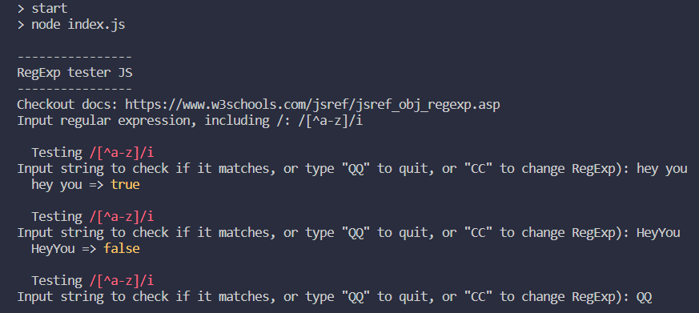

# RegExp Tester

A simple and quick command line RegExp tester.
 ```
 npm i
 ```
Can be run be run with or without a RegExp argument, though some characters might not work when added as a environmental variable.
 ```
 npm start
 npm start "/[a-z]/i"
 ```
And it will look like this in the terminal:

 
